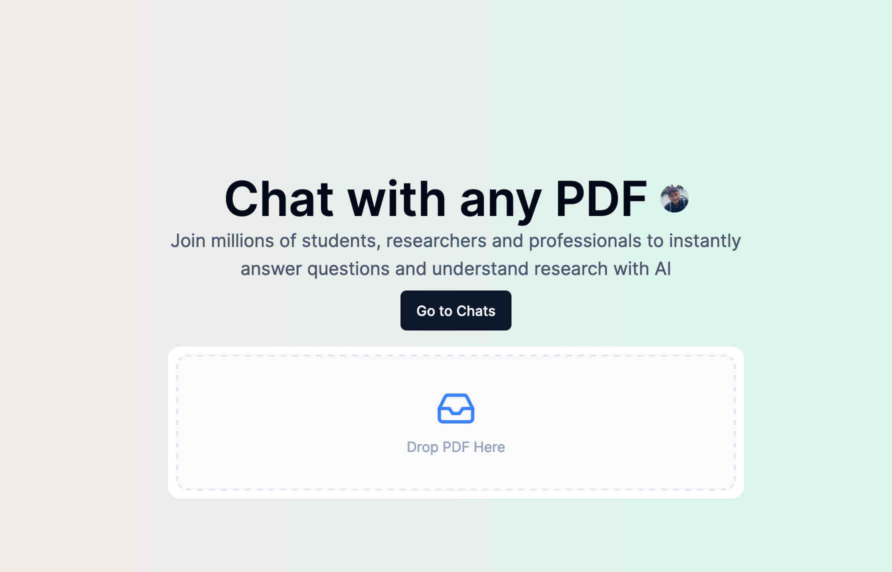

# Learn PDF
Is a demo project forked from [ChatPDF-yt](https://github.com/Elliott-Chong/chatpdf-yt/tree/main)

Drop your PDF and start to chat with it using the power of LLMs.




The project uses
- ClerkJS
- Pincone for Vector Store
- NeonDB for a PG database
- OpenAI for LLM
- S3 for Storing files. 

To get started configure the following `.env` 

```
DATABASE_URL=

NEXT_PUBLIC_S3_ACCESS_KEY_ID=
NEXT_PUBLIC_S3_SECRET_ACCESS_KEY=
NEXT_PUBLIC_S3_BUCKET_NAME=
NEXT_PUBLIC_S3_END_POINT=s3.us-east-1.amazonaws.com

PINECONE_ENVIRONMENT=us-east-1
PINECONE_API_KEY=

OPENAI_API_KEY=
``` 

Following .env.local file is also required for the Clerk Config
```
NEXT_PUBLIC_CLERK_PUBLISHABLE_KEY=
CLERK_SECRET_KEY=
NEXT_PUBLIC_CLERK_FRONTEND_API=
``` 


This is a [Next.js](https://nextjs.org/) project bootstrapped with [`create-next-app`](https://github.com/vercel/next.js/tree/canary/packages/create-next-app).

## Getting Started

First, run the development server:

```bash
npm run dev
# or
yarn dev
# or
pnpm dev
# or
bun dev
```

Open [http://localhost:3000](http://localhost:3000) with your browser to see the result.

